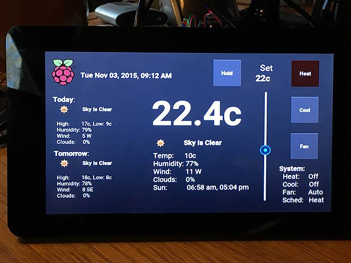
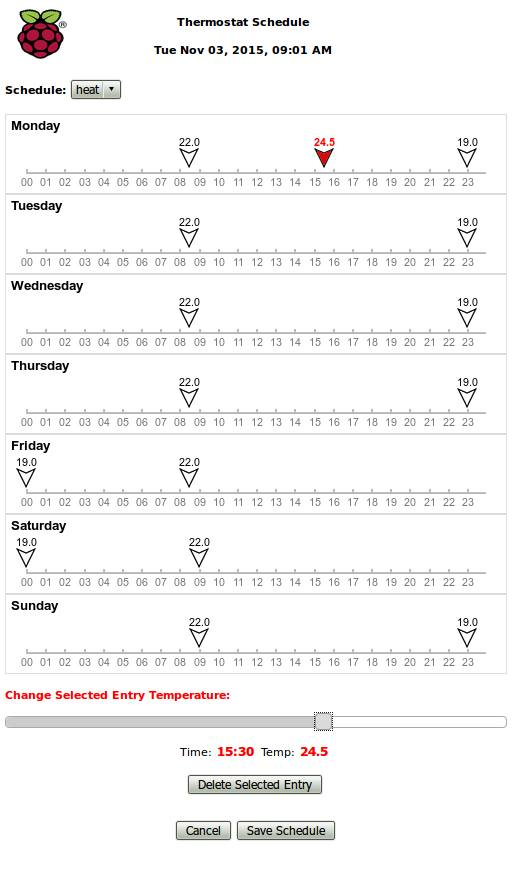
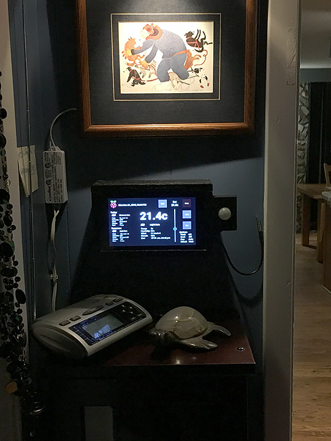

# Raspberry Pi Thermostat Implementation

Author: 	Andrzej Taramina
Email:		andrzej at chaeron dot com
License:	MIT

**THE SOFTWARE IS PROVIDED "AS IS", WITHOUT WARRANTY OF ANY KIND, EXPRESS OR IMPLIED, INCLUDING BUT NOT LIMITED TO THE WARRANTIES OF MERCHANTABILITY,
FOR A PARTICULAR PURPOSE AND NONINFRINGEMENT. IN NO EVENT SHALL THE AUTHORS OR COPYRIGHT HOLDERS BE LIABLE FOR ANY CLAIM, DAMAGES OR OTHER
LIABILITY, WHETHER IN AN ACTION OF CONTRACT, TORT OR OTHERWISE, ARISING FROM, OUT OF OR IN CONNECTION WITH THE SOFTWARE OR THE USE OR OTHER DEALINGS IN THE
SOFTWARE.**

-----------------------------------------------------------------------------------------------------------------------------------------

This project is a fairly comprehensive implementation of a Thermostat for a Raspberry Pi, designed to run on the new 7" Touch Sensitive LCD screen. 

Key features include:

	1. Touch senstive thermostat display/control for the Official Raspberry Pi Foundation 7" Touch Sensitive LCD screen.
	2. Schedule support, including separate daily schedules for Heat and Cool modes
	3. Built in web interface/server to enable control of thermostat and edit schedule remotely through any browser (including touch-sensitive iOS devices)
	4. Current weather and today/tomorrow weather forecasts using openweathermap.org
	5. The implementation will run on non-Pi linux machines (eg. Ubuntu) for testing purposes, using simulated GPIO and a fixed current temperature
	6. Battery backup (optional)
	7. Supports Celcius (default) or Farenheit
    8. Supports calibration of your temperature sensor
	9. Minimal UI (screensaver) mode
	10. PIR Motion sensor to switch from minimal to full UI mode (optional)
	11. Detailed logging with selectable levels, including optional remote logging to a MQTT broker/server

###Thermostat User Interface

**Thermostat UI on Touch Screen:**

**Thermostat Web UI - Settings:**

**Thermostat Web UI - Edit Schedule:**

**Note**: *Double click/tap on a blank space in the schedule to create a new entry*

**Thermostat Hardware - Internals:**

The author's final internals, before the case top was installed. Green board closest to the bottom of the photo is the Raspberry Pi 2 computer. Red board is a custom prototyping board that was used to interface the temperature sensor, motion sensor and tie into the relay boards. The two green boards are the relay boards that actually switch the HVAC lines. The small blue board on top is a battery charging controller, with the LiPo battery in gold on the lower right.

**Thermostat Installation:**

The new Pi thermostat in it's custom wood enclosure. mounted on the wall in the author's hallway. Motion sensor is on the right side. You can also see the temperature sensor to the right of the motion sensor....it has be be outside the case, since the Pi computer generates enough heat that it would affect the measurement if the temp sensor was inside.

##Hardware (as used/tested by author):

	- Raspberry Pi 2 Model B
	- Official Raspberry Pi Foundation 7" Touch Sensitive LCD screen
	- CanaKit WiFi Adapter 150 Mbps
	- Prototyping shield/board
	- Makeatronics 24V AC SSR Board relay board(s) to interface to furnace/AC (from http://makeatronics.blogspot.com/p/store.html, fully assembled)
	- PowerBoost 1000 Charger (from Adafruit)
	- Lithium Ion Polymer Battery - 3.7v 2500mAh (from Adafruit)
	- DS18B20 Weatherproof temperature sensor
	- Pimoroni Raspberry Pi 7" Touchscreen Display Case (optional, from Adafruit)
	- Adafruit PIR sensor (optional, https://www.adafruit.com/products/189)
	- Custom built wooden thermostat enclosure

##Software Requirements (as used/tested by author):

	- Latest Raspbian OS
	- Python 2.7
	- Kivy (Ver 1.9.1 dev) UI framework
	- Additional required python packages:
	    - w1thermsensor
	    - FakeGPIO (for testing on non-Pi platforms, customized version included)
	    - CherryPy (web server)
	    - schedule (for scheduled events)
	    - openweathermap.org app key 
	    - Optional: MQTT client library (paho-mqtt, for remote logging and sensor support) 
		

##Software installation:

	1. Make sure you have the latest Raspbian updates
	2. Install Kivy on your Pi using the instructions found here: http://www.kivy.org/docs/installation/installation-rpi.html
	3. Install additional python packages: CherryPy, schedule & w1thermsensor using the command "sudo pip install ..."
	4. Get an openweathermap.org app key if you don't have one from here: http://www.openweathermap.org/appid
	5. Edit the thermostat_settings.json file and insert your Open Weather Map app key in the appropriate spot. Also change the location to your location.
	6. If you want to use remote logging to a MQTT broker/server, do a "sudo pip install paho-mqtt" to install the required client libraries, and enable/configure MQTT settings in thermostat_settings.json	

##Hardware Configuration:

The software comes configured to use the following default GPIO pins:

	GPIO 4  - Temperature sensor
	GPIO 18 - Cool (A/C) relay control
	GPIO 23 - Heat (Furnace) relay control
	GPIO 25 - Fan relay control
	GPIO 5  - PIR Motion Sensor (optional)
 
If you wish to use different pins, then change the appropriate values in the thermostat_settings.json file. 

The author used a Raspberry Pi 2 Model B for his thermostat. Less capable Pi hardware may not provide adequate response times for the touch and web interfaces.

See http://makeatronics.blogspot.com/2013/06/24v-ac-solid-state-relay-board.html for how to wire the thermostat into your heating/cooling system, and 
https://learn.adafruit.com/adafruits-raspberry-pi-lesson-11-ds18b20-temperature-sensing/hardware for how to wire the temperature sensor into the Pi. 

The author's HVAC system had separate R and Rc hot lines, with the furnace switched to the R and the A/C and fan switched to the Rc lines, and so required two separate
Makeatronics 24V AC SSR Boards. YMMV.

##Temperature Sensor Calibration:

The implementation supports calibration of your DS18B20 temperature sensor, following the method outlined here: https://learn.adafruit.com/calibrating-sensors/two-point-calibration

If you want to calibrate your DS18B20 (you should be using a weatherproof sensor if you want to do calibration!), then find out your elevation (meters or feet, depending on which measurement 
system you are using), measure the temperature in an ice bath and in boiling water, and change the elevation and measured freezing/boiling points in the thermostat_settings.json file.

The default values in the thermostat_settings.json file(s) effectively do no correction, so you can leave them alone if you don't want to calibrate your temperature sensor.

 
##Running the Thermostat Code: 

You can run the code as follows:

	sudo python thermostat.py

You need sudo since the code accesses the Pi GPIO pins, which requires root priviledges

To have the thermostat code start automatically at boot time, copy the resources/thermostat.desktop file into /home/pi/.config/autostart/. This assumes that you have put
the thermostat code in /home/pi/thermostat. If you have the code elsewhere then edit thermostat.desktop and thermostat.sh to point to where you have the code.

To access the Web-based interface to control the thermostat and change the schedule, just point your favourite browser at the IP address that your Pi board is set to. For example, the author's thermostat is on 10.66.66.30, so entering http://10.66.66.30 will bring up the web interface. The Web Interface is touch sensitive on IOS devices. If you bring up the Web Interface on Safari on an IOS device (iPhone/iPad), you can save it to your home page, and it will use a nice thermostat icon.

##Security/Authentication:

This implementation assumes that your Pi Thermotstat is on a private, access controlled, local wifi network, and is not accessible over the internet. As such, there
is no security implemented for the web interface. Anyone with access to the wifi network will be able to control your thermostat! If you want/need more stringent
security/authentication controls for your thermostat, you will have to implement them yourself for now.

##Minimal UI (screensaver) mode: 

The Minimal UI (screensaver) mode is enabled by default. This mode will just show the current temperature, greyed out after a specified timeout. To restore the full UI, just touch the screen anywhere. You can disable this in the in the thermostat_settings.json file. Default timeout to display the minimal UI is 1 minute, and can be changed in the in the settings file as well.

You can optionally attach a PIR motion sensor and use that to switch back to full UI mode when motion is detected. Use of a PIR sensor is disabled by default. You can enable the PIR sensor in the thermostat_settings.json file.
If you are using the PIR Motion Sensor, you can also specify a From/To time range (HH:MM for each) during which you wish to ignore any sensed motion, in effect, making you touch the screen to show the full UI during the specified time period. Default settings are not to ignore the PIR Motion Sensor ever (eg. From/To both set to "00:00").  This was a feature request from the boss (wife!), so that the display would not switch to the full UI in the wee hours when she gets up to go to the bathroom. 

##Logging:

This implementation is fully instrumented with logging capabilities. Logging channel (destination) and level are set in the thermostat_settings.json file.

Available logging channels include:

	none  - no logging
	file  - log to thermostat.log file (default)
	print - log to sysout
	mqtt  - log to a remote MQTT server/broker (mqtt settings must be set up in thermostat_settings.json file)

Logging levels include:

	error - Only log error conditions
	state - Log thermostat state changes only (eg. temperature change, system status changes, etc.) (default)
	info  - Log detailed information/settings (this logs a lot of information!)
	debug - Log debug information (this logs a lot of stuff!)

Each logging level includes those above it in the list, for example: info level logging also enables state and error logging entries. 

Default logging is set to log to a file with level: state.

##MQTT Support:

The thermostat code supports logging to a remote MQTT broker/server (if you enable/configure MQTT and also set logging to use mqtt as the channel). This was implemented to allow for tracking of thermostat operation and conditions on a remote server, to enable more detailed analysis/tuning of thermostat/HVAC system performance. For example, log entries could be saved to a mySQL (or other) database, and then analyzed to determine longer term trends, system lag time (eg. how long does it take the HVAC system to bring the temperature up/down to the desired level) to allow for "smart/learning" thermostat capabilities down the road. Rather than complicate the thermostat code with such analysis, and add extra load/software on the thermostat (eg. running a mySQL DBMS on the thermostat Pi), it seemed to make more sense to farm that out to a remote machine instead.

If you want to use remote logging to a MQTT broker/server, do a "sudo pip install paho-mqtt" to install the required client libraries, and configure MQTT settings in thermostat_settings.json to enable MQTT and point to your remote MQTT broker/server instance. The author is running the mosquitto MQTT broker on a separate Raspberry Pi for this purpose.

Down the road, functionality will be added to use MQTT to forward remote sensor readings back to the thermostat (eg. multiple, remote battery-powered, wireless temperature/humidity/pressure sensors that can be placed in various rooms in the house).

##Credits

Thanks to [Jeff - The Nooganeer](http://www.nooganeer.com/his/category/projects/homeautomation/raspberry-pi-thermostat/), who's blog posts got me started in the right direction for the hardware needed for this project.

Thanks to [Adafruit - Temperature Sensing Tutorial](https://learn.adafruit.com/adafruits-raspberry-pi-lesson-11-ds18b20-temperature-sensing/hardware) for info on how to wire
a DS18B20 temperature sensor into the Raspberry Pi.
 
And finally, thanks to [Nich Fugal/Makeatronics](http://makeatronics.blogspot.com/2013/06/24v-ac-solid-state-relay-board.html) for his great 24V AC Solid State Relay Board.

##Additional Notes/Comments:
 
1. Default temperatures are in degrees Celcius, a righteous metric scale. If you wish to configure the thermostat to use the Farenheit system, you will need to replace 
   the .json config files with those in the resources/farenheit directory.

2. Future versions may include smart capabilities supporting remote wireless temperature sensors, logging/analysis, security/authentication and more. But don't hold your breath...

3. Feel free to hack the code, so long as you credit the source. It is assumed that if you do, you have some familiarity with programming, python, web coding and the like.

4. You are welcome to ask questions about the implementation and to offer suggestions to the author. 

Enjoy!

....Andrzej

	
